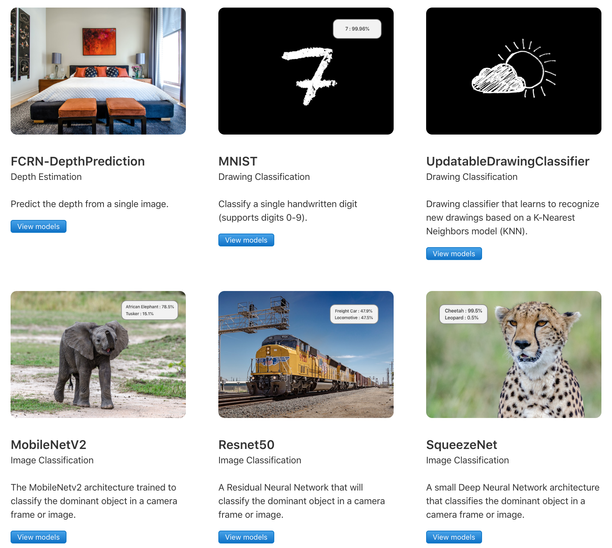

# CoreML-Practice-with-SwiftUI

This is a CoreML Practice with SwiftUI. Pretrained Models from [Apple CoreML Models](https://developer.apple.com/machine-learning/models/). 

## included Demos

* **FCRN-DepthPrediction** [FCRN-DepthPrediction](https://github.com/iro-cp/FCRN-DepthPrediction)
* **MNISTClassifier** [MNIST](http://yann.lecun.com/exdb/mnist/)
* **ImageClassifier** [MobileNetV2](https://github.com/tensorflow/models/tree/master/research/slim/nets/mobilenet)、[Resnet50](https://github.com/fchollet/deep-learning-models/blob/master/resnet50.py)、[SqueezeNet](https://github.com/DeepScale/SqueezeNet)
* **Object Detection** [YOLOv3](https://github.com/pjreddie/darknet)

